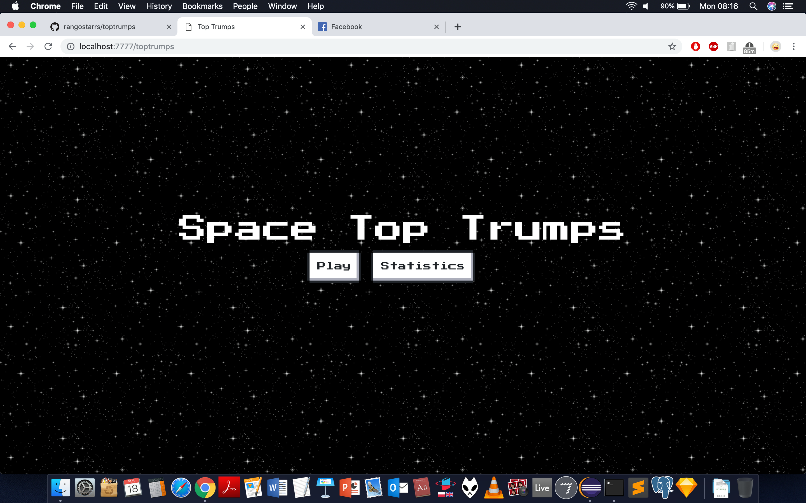
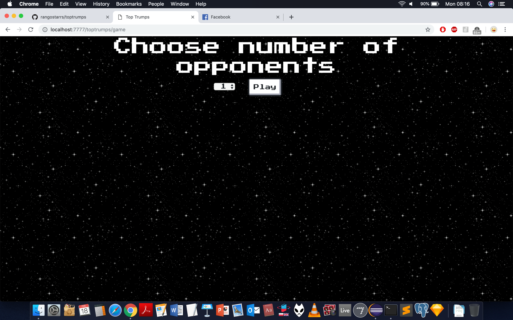
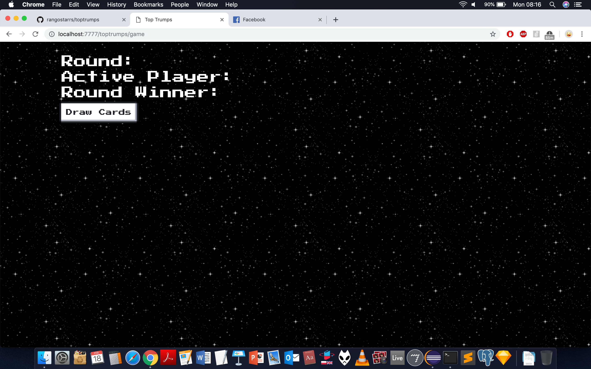
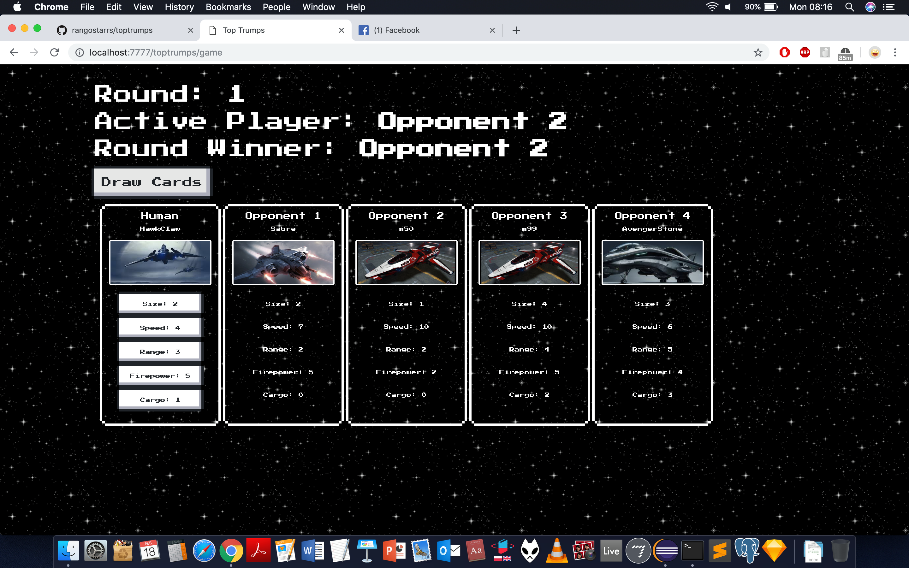
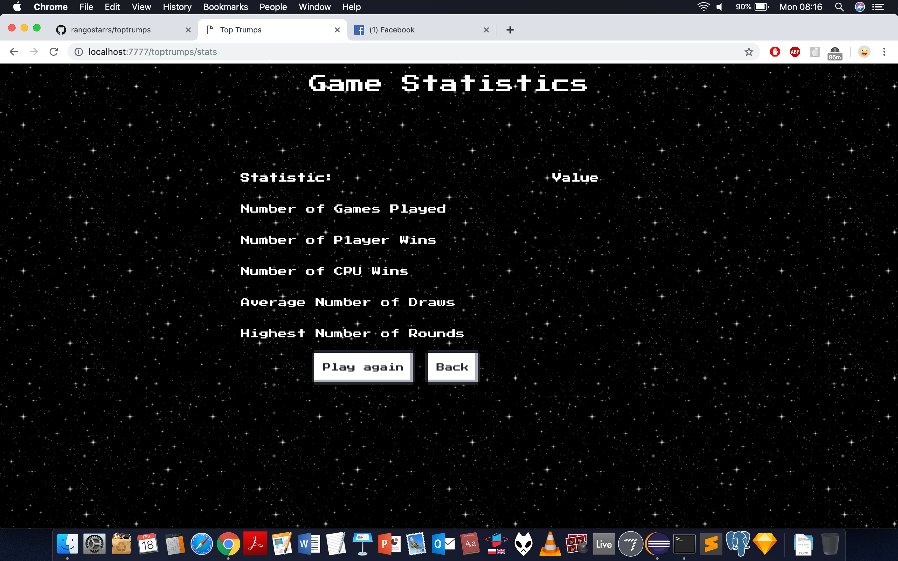

# MScTeamProject

This was a module in the second semester of my MSc in Software Development; a team project to develop a Top Trumps game (command line and online versions). The project was developed in five weeks in collaboration with Nick Louis, Toby Randall-Paley, Monika Nizio, and Reiko Lill. Grade: A3

https://github.com/rangostarrs/toptrumps

